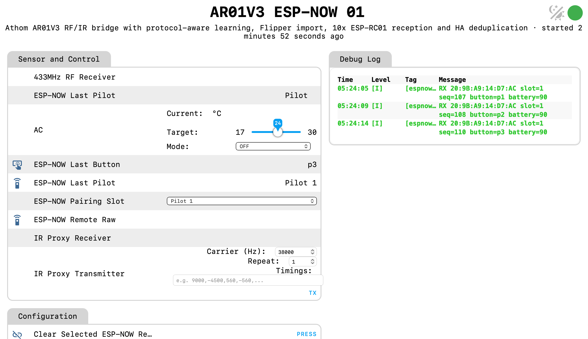
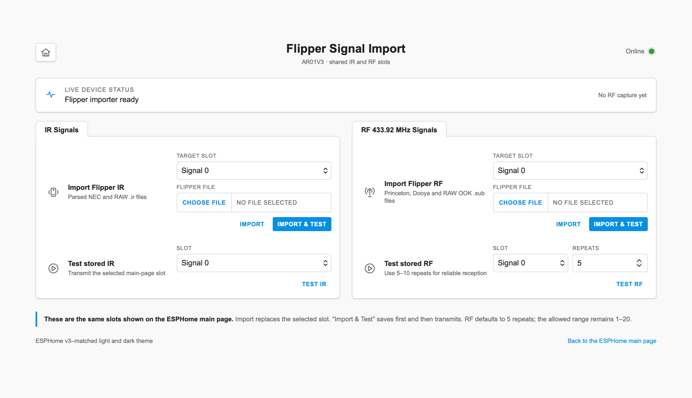
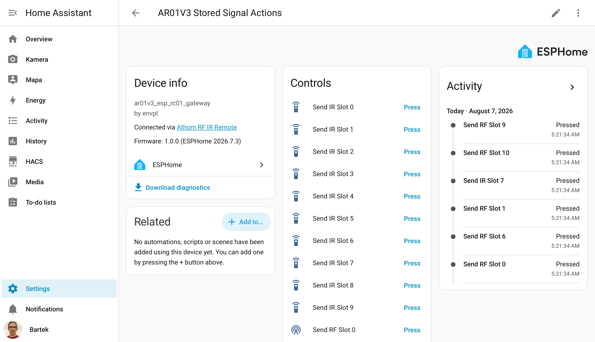
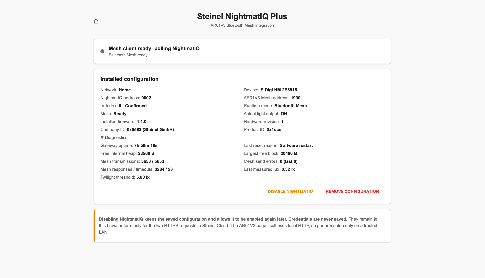

# Bramka AR01V3 RF/IR, ESP-RC01 i Steinel NightmatIQ Plus

[](https://github.com/supczinskib/athom-ar01v3-esp-rc01-gateway/actions/workflows/ci.yml)

[English README](README.md)

> **Lokalne sterowanie RF, IR, ESP-RC01 i opcjonalnym Steinel NightmatIQ Plus z Home Assistant lub bez niego.**

```text
Pilot RF/IR -> Flipper Zero -> plik .sub/.ir -> bramka AR01V3 (+ opcjonalne piloty ESP-RC01) -> Home Assistant
Steinel NightmatIQ Plus <-> Bluetooth Mesh <-> bramka AR01V3 -> Home Assistant
```

Społecznościowy firmware ESPHome, który przekształca oparty na ESP32 Athom AR01V3 w lokalną bramkę RF, IR i ESP-NOW. Zapewnia 16 trwałych slotów RF i 10 trwałych slotów IR, zdalne programowanie sygnałów przez sieć, standardowe encje przycisków Home Assistant, parametryzowane i wygodne w GUI akcje nadawania oraz obsługę do 10 pilotów ESP-RC01 przez maksymalnie 10 odbiorników AR01V3. Każdy przycisk ESP-RC01 może zostać przekazany do Home Assistant albo bezpośrednio przypisany do zapisanego slotu IR/RF, co umożliwia autonomiczne działanie bez dostępnego Home Assistant. Zapisane polecenia można również przypisywać do wirtualnych urządzeń, skryptów, scen i automatyzacji bez zahardkodowanych mapowań sprzętu.

Wersja 1.2.0 dodaje opcjonalną lokalną integrację Bluetooth Mesh i Home Assistant ze Steinel IS Digi NM 2E6915 NightmatIQ Plus, zachowując w tym samym firmware funkcje RF, IR, ESP-NOW, import Flippera i OTA.

Autor i opiekun projektu: **Bartosz Supcziński** — <bartek@env.pl>

## Dlaczego powstał ten projekt

AR01V3 jest niedrogi, zasilany z sieci, podłączony do sieci i dobrze nadaje się do stałego umieszczenia w pomieszczeniu, w którym trzeba wysyłać polecenia RF lub IR. Projekt zmienia zapisane w nim sygnały w zasoby Home Assistant wielokrotnego użytku zamiast pozostawiać sterowanie wyłącznie na stronie urządzenia. Każdy slot ma osobną encję przycisku, a akcje parametryzowane pozwalają korzystać z zapisanych i przekazywanych bezpośrednio sygnałów z poziomu GUI Home Assistant.

Gdy dostępny jest zgodny plik albo definicja sygnału, zainstalowaną bramkę można zaprogramować i przetestować przez sieć. Nie trzeba podłączać jej przez USB, ponownie kompilować firmware, znajdować się obok AR01V3 ani przynosić oryginalnego pilota do miejsca instalacji. Jest to szczególnie przydatne dla bramek zamontowanych w oddalonych, trudno dostępnych albo wielu różnych lokalizacjach.

Obsługa ESP-RC01 dodaje drugą rolę: niedrogie fizyczne piloty mogą przez ESP-NOW uruchamiać działania Home Assistant albo bezpośrednio wysyłać zapisane polecenie IR/RF z odbierającego AR01V3. Przypisanie lokalne jest zapisane w bramce i nie wymaga aktywnego połączenia z Home Assistant. Dla przycisków przekazywanych do HA kilka odbiorników AR01V3 może słuchać tego samego pilota, zapewniając większy zasięg, a dołączony pakiet usuwa duplikaty odbioru i generuje jedno kanoniczne zdarzenie.

Sygnał można dostarczyć do systemu na trzy sposoby: przez lokalną naukę, import obsługiwanego pliku albo bezpośrednią akcję Home Assistant, która nie korzysta ze slotu.

## Dodawanie sygnałów i opcjonalna obsługa Flippera

Flipper Zero nie jest wymagany. AR01V3 może bezpośrednio uczyć się obsługiwanych sygnałów IR oraz sygnałów RF, które potrafi zdekodować jako RC-Switch. Import plików zgodnych z Flipperem jest opcjonalną drogą awaryjną, gdy AR01V3 nie potrafi niezawodnie nauczyć się sygnału albo gdy zgodny plik `.sub` lub `.ir` jest już dostępny. Plik można zaimportować bez posiadania urządzenia, którym został pierwotnie przechwycony.

AR01V3 korzysta z niedrogiego sprzętu OOK/ASK pracującego na stałej częstotliwości 433,92 MHz. Sprawdza się jako bramka automatyki, ale nie jest pełnym analizatorem RF i nie można oczekiwać, że niezawodnie zdekoduje każdy własnościowy protokół. Flipper Zero albo inny odpowiedni analizator może dostarczyć zweryfikowane przechwycenie referencyjne dla sygnałów wykraczających poza możliwości niezawodnej lokalnej nauki.

Nie każde przechwycenie RF jest uniwersalne. Plik może zawierać identyfikator nadajnika, kanał, adres albo informacje związane z parowaniem, dlatego sygnał pochodzący z innej instalacji nie musi bez zmian zadziałać z każdym silnikiem lub odbiornikiem. Nawet gdy bezpośrednie wykorzystanie pliku nie jest możliwe, zweryfikowane przechwycenie może dostarczyć danych potrzebnych do poprawienia natywnej obsługi protokołu.

Zgodność z Flipperem jest ograniczona do formatów wymienionych poniżej oraz do sprzętu RF 433,92 MHz OOK/ASK i obsługiwanej ścieżki nadawczej IR w AR01V3.

## Zgodność z formatami Flippera

| Format Flippera | Import | Odtwarzanie |
| --- | :---: | :---: |
| Princeton 433,92 MHz OOK/ASK | Tak | Tak |
| Statyczny Dooya 40-bit 433,92 MHz OOK/ASK | Tak | Tak |
| SubGhz RAW OOK 433,92 MHz | Tak | Tak |
| IR NEC | Tak | Tak |
| IR RAW | Tak | Tak |
| Rolling code | Nie | Nie |
| FSK, inne częstotliwości RF lub nieobsługiwane presety | Nie | Nie |

## Zrzuty ekranu

### Główna strona AR01V3

Interfejs ESPHome Web Server v3 łączy sterowanie sygnałami, parowanie ESP-RC01 i autonomiczne przypisania przycisków, diagnostykę oraz zachowane funkcje AR01V3.



### Zintegrowany importer Flippera

Strona `/flipper` importuje i testuje obsługiwane pliki `.sub` i `.ir` bezpośrednio w tych samych trwałych slotach, z których korzystają strona główna i Home Assistant.



### Akcje zapisanych sygnałów w Home Assistant

Każdy zapisany slot IR i RF jest dostępny jako zwykły przycisk Home Assistant w urządzeniu `AR01V3 Stored Signal Actions`.



### Steinel NightmatIQ Plus

Chroniona strona `/steinel` importuje wybraną sieć Steinel, steruje opcjonalnym trybem Bluetooth Mesh oraz pokazuje potwierdzony stan urządzenia i diagnostykę.



## Najważniejsze możliwości

### Sloty RF i IR

- 16 trwałych slotów RF, numerowanych od `0` do `15`.
- 10 trwałych slotów IR, numerowanych od `0` do `9`.
- Jedna wspólna pamięć NVS: nauka, import Flippera, strona WWW, lokalne wysyłanie i Home Assistant korzystają z tych samych rekordów.
- Podgląd szesnastkowy zajętego slotu i wartość `None` dla pustego.
- 26 osobnych przycisków Home Assistant w podurządzeniu `AR01V3 Stored Signal Actions`.
- Liczba powtórzeń RF od 1 do 20, domyślnie 5, oraz opcjonalna przerwa od 0 do 100 ms.

### RF 433,92 MHz

- Odbiór OOK/ASK na GPIO19 i nadawanie na GPIO18.
- Nauka RC-Switch zapisuje sygnał dopiero po odebraniu trzech zgodnych ramek.
- Protokół RC-Switch 6 jest zapisywany wraz z właściwym numerem protokołu i kodem. Potwierdzony przypadek 24-bitowy jest odtwarzany jako zgodny przebieg Princeton z `TE=403 µs` i `Guard_time=30`.
- Import i odtwarzanie plików Princeton, statycznego 40-bitowego Dooya oraz SubGhz RAW.
- Lokalna nauka dowolnego RF RAW w trybie „magnetofonu” jest celowo wyłączona. Tani odbiornik OOK w AR01V3 nie udostępnia RSSI ani squelch i potrafi zwrócić szum jako pozornie poprawne czasy. Nauka lokalna wymaga dekodowania RC-Switch; dla RAW i statycznego Dooya należy używać importu Flippera.

### IR

- Odbiór na GPIO33 i nadawanie na GPIO25.
- Nauka najpierw próbuje rozpoznać NEC, a następnie korzysta z RAW.
- Import plików `.ir` w formacie parsed NEC, parsed NECext i raw.
- Sygnały nauczone, zaimportowane, zapisane w slotach i przekazane bezpośrednio z HA korzystają z tej samej ścieżki nadawczej.

### Import z Flippera

- Chroniona hasłem strona `http://ADRES_URZĄDZENIA/flipper`.
- Wygląd spójny ze stroną ESPHome Web Server v3.
- RF: Princeton, statyczny 40-bitowy Dooya i SubGhz RAW OOK przy 433,92 MHz.
- IR: parsed NEC, parsed NECext i raw timings.
- Status online, walidacja, import, transmisja testowa, stan przechwytywania i czyszczenie slotu bez przechodzenia do osobnego JSON-a.
- Neutralne pliki testowe w katalogu [examples](examples/).

### Zdalne programowanie sygnałów

- Wgranie obsługiwanego pliku `.sub` lub `.ir` do wybranego trwałego slotu przez chronioną stronę `/flipper`.
- Sprawdzenie walidacji i bieżącego stanu slotu, transmisja testowa, zastąpienie sygnału albo jego usunięcie bez fizycznego dostępu do AR01V3.
- Wysyłanie z Home Assistant dowolnego zapisanego slotu albo obsługiwanych danych IR/RF bez używania slotu, bezpośrednio przez API ESPHome.
- Osobne zarządzanie bramkami AR01V3 mającymi różne adresy z tej samej zaufanej sieci albo przez bezpieczny VPN.
- Przechwycenie nieznanego wcześniej sygnału może nadal wymagać dostępu do oryginalnego pilota i odpowiedniego sprzętu, ale zaprogramowanie zainstalowanej bramki już nie.

Wbudowany interfejs WWW korzysta z uwierzytelniania HTTP Digest, ale nie zapewnia szyfrowania transmisji HTTPS. Nie należy wystawiać go bezpośrednio do publicznego Internetu; powinien być używany w zaufanej sieci lokalnej albo przez VPN.

### ESP-RC01 i wiele odbiorników

- Dziesięć logicznych slotów parowania ESP-RC01 w każdym AR01V3.
- Trwałe zapisywanie MAC, 60-sekundowe okno parowania, kasowanie pary, bateria, nazwa i kod przycisku, numer sekwencji oraz identyfikator odbiornika.
- Trwałe przypisania przycisków zgłaszanych przez każdy sparowany pilot.
- Dla każdego przycisku można wybrać `Home Assistant`, `Ignore`, dowolny slot IR `0..9` albo dowolny slot RF `0..15`.
- Dziesięć osobnych encji zdarzeń `ESP-NOW Pilot N Button` pozwala rozróżnić w automatyzacjach GUI te same przyciski na różnych pilotach.
- Lokalne przypisanie IR/RF wykonuje sam AR01V3 i działa bez aktywnego połączenia z Home Assistant.
- Domyślną akcją każdego przycisku jest `Home Assistant`, która przekazuje go do zdarzenia właściwego dla danego pilota.
- Maksymalnie dziesięć AR01V3 może pokrywać ten sam obszar. Nie jest to mesh z retransmisją — każdy odbiornik zgłasza bezpośrednio odebraną kopię.
- Pakiet Home Assistant przyjmuje pierwszą kopię, odrzuca duplikaty z pozostałych odbiorników i generuje wyłącznie właściwe zdarzenie `esp_rc01_pilot_N_button`.

### Home Assistant

- 26 encji typu przycisk: `Send IR Slot 0..9` oraz `Send RF Slot 0..15`.
- Akcje do wysyłania wskazanego slotu z kontrolą parametrów i odpowiedzią o powodzeniu.
- Bezpośrednie akcje bez używania slotów: NEC, IR RAW, Princeton, statyczny Dooya i RF RAW.
- Proste warianty akcji, których pola są widoczne w edytorze GUI Home Assistant.
- Brak zahardkodowanego projektora, amplitunera, ekranu czy lampy. Użytkownik sam przypisuje sloty do wirtualnych urządzeń, skryptów, scen i automatyzacji.

### Zachowane funkcje bazowe

- Natywne API i OTA ESPHome.
- Główna strona ESPHome Web Server v3 z HTTP Digest Auth.
- Aktualizacja firmware przez przeglądarkę.
- Bluetooth Proxy z dwoma slotami połączeń.
- Diagnostyka Wi-Fi, uptime, restart, safe mode, factory reset, awaryjny punkt dostępowy i dioda statusu.
- Encje klimatyzacji IR odziedziczone z konfiguracji bazowej.

### Opcjonalna integracja Steinel NightmatIQ Plus

Zwykły firmware zawiera chronioną stronę `/steinel`, która może pobrać z chmury
Steinel kopię wybranej sieci bez zapisywania hasła konta. Integracja tworzy w
Home Assistant osobne urządzenie NightmatIQ z natężeniem światła, progiem
zmierzchowym, trybem pracy, odpornym stanem rzeczywistego wyjścia, zainstalowaną
wersją firmware, rewizją sprzętową, Company ID i Product ID. AR01V3 domyślnie
działa jako Bluetooth Proxy; włączenie NightmatIQ przełącza następny start na
Bluetooth Mesh. Wyłączenie przez WWW zachowuje dane Mesh i po restarcie
przywraca Bluetooth Proxy. RF, IR i ESP-NOW pozostają dostępne w obu trybach.
Szczegóły zawiera [polska instrukcja NightmatIQ](docs/NIGHTMATIQ_PL.md).

## Sprzęt i GPIO

Projekt jest przeznaczony dla **Athom AR01V3 z ESP32 i pamięcią flash 8 MB**.

| Funkcja | GPIO | Informacja |
| --- | ---: | --- |
| Odbiornik RF | 19 | wejście odwrócone, 433,92 MHz |
| Nadajnik RF | 18 | wyjście OOK/ASK |
| Odbiornik IR | 33 | wejście odwrócone |
| Nadajnik IR | 25 | wyjście z nośną |
| Przycisk lokalny | 0 | wejście odwrócone |
| Dioda statusu | 27 | wyjście statusu |

Nie należy wgrywać tej konfiguracji do innej rewizji urządzenia bez sprawdzenia schematu i pinów.

## Struktura repozytorium

| Ścieżka | Przeznaczenie |
| --- | --- |
| `esphome/ar01v3-01.yaml` … `ar01v3-10.yaml` | Dziesięć unikalnych konfiguracji odbiorników |
| `esphome/ar01v3-espnow-10x10-base.yaml` | Wspólna konfiguracja firmware |
| `esphome/components/` | Pamięć sygnałów i importer Flippera |
| `home-assistant/` | Pakiet deduplikacji ESP-RC01, schemat automatyzacji i przykłady |
| `examples/` | Neutralne przykłady Princeton, Dooya i NEC |
| `scripts/` | Instalacja, konfiguracja, walidacja, kompilacja, wgrywanie i logi |
| `tests/` | Testy regresji i kompilacji komponentów na komputerze |

## Wymagania

- Athom AR01V3.
- Przewód USB-C z liniami danych do pierwszej instalacji i odzyskiwania.
- Sieć Wi-Fi 2,4 GHz.
- Debian lub Ubuntu dla gotowych skryptów instalacyjnych; na innym systemie można użyć standardowej instalacji ESPHome.
- Python 3.12, 3.13 albo 3.14.
- ESPHome 2026.7.3.
- Home Assistant z integracją ESPHome, jeżeli mają być używane funkcje HA. Nie jest potrzebny do działania skonfigurowanego wcześniej, autonomicznego przypisania ESP-RC01 do slotu.

Dla stabilnego ESP-NOW wszystkie punkty dostępowe obsługujące odbiorniki powinny używać tego samego, stałego kanału 2,4 GHz. ESP32 przechodzi na kanał swojego Wi-Fi, dlatego automatyczna zmiana kanału może sprawić, że odbiorniki podłączone do różnych AP nie usłyszą tej samej transmisji ESP-NOW.

## 1. Pobranie i przygotowanie

```bash
git clone https://github.com/supczinskib/athom-ar01v3-esp-rc01-gateway.git
cd athom-ar01v3-esp-rc01-gateway
```

Instalacja przypiętej wersji ESPHome na Debianie lub Ubuntu:

```bash
sudo bash scripts/01_install_esphome.sh
```

Powstanie środowisko `/opt/esphome-10x10`. Jeżeli ESPHome jest zainstalowany gdzie indziej, przed uruchamianiem skryptów można ustawić zmienną `ESPHOME` na ścieżkę do jego programu wykonywalnego.

## 2. Hasła i Wi-Fi

```bash
bash scripts/02_configure_secrets.sh
```

Należy podać:

- SSID i hasło Wi-Fi 2,4 GHz;
- login do lokalnego panelu WWW;
- hasło panelu mające 12-63 znaki;
- opcjonalnie osobne hasło awaryjnego AP. Enter ustawia hasło panelu WWW.

Skrypt tworzy `esphome/secrets.yaml`, generuje i zachowuje mocne hasło OTA, a dla awaryjnego AP domyślnie używa hasła panelu WWW. Osobne hasło AP jest zapisywane tylko po jego wpisaniu i powtórzeniu. Plik otrzymuje prawa `0600`, jest ignorowany przez Git i nie wolno go publikować ani przesyłać innym osobom.

Przy konfiguracji ręcznej należy skopiować `esphome/secrets.example.yaml` jako `esphome/secrets.yaml` i zastąpić wszystkie wartości przykładowe.

## 3. Wybór odbiornika

Każdy fizyczny AR01V3 otrzymuje osobny plik:

- pierwszy: `esphome/ar01v3-01.yaml`;
- drugi: `esphome/ar01v3-02.yaml`;
- kolejne do `ar01v3-10.yaml`.

Każdy ma unikalną nazwę ESPHome i `receiver_id`. Nie należy wgrywać tego samego numeru do dwóch aktywnych urządzeń. Można zmienić `friendly_name`, `room` i `timezone`, zachowując unikalne `name` i `receiver_id`. Domyślna wersja publiczna używa `UTC` i pustego obszaru.

## 4. Walidacja

Pełna kontrola źródeł, parsera, komponentów C++, YAML i wszystkich dziesięciu konfiguracji:

```bash
bash scripts/03_validate_all.sh
```

Szybsze testy lokalne bez pełnej walidacji ESPHome:

```bash
bash scripts/00_self_test.sh
```

Przed utworzeniem czystego archiwum albo wydania GitHub należy uruchomić ostrzejszy tryb publikacyjny w kopii, która nie zawiera `esphome/secrets.yaml`:

```bash
bash scripts/00_self_test.sh --publication
```

Zwykła walidacja instalacji celowo dopuszcza lokalny, ignorowany przez Git plik `secrets.yaml`; tryb publikacyjny go odrzuca.

Poprawna walidacja nie potwierdza zasięgu RF ani zgodności z konkretnym sprzętem — to trzeba sprawdzić fizycznie.

## 5. Kompilacja

Dla odbiornika 01:

```bash
bash scripts/04_compile_one.sh 01
```

Skrypt wypisze ścieżki do utworzonych plików `firmware.factory.bin`, `firmware.bin` i/lub `firmware.ota.bin`. Wszystkie konfiguracje należy kompilować tylko wtedy, gdy rzeczywiście potrzebne jest dziesięć obrazów:

```bash
bash scripts/06_compile_all.sh
```

## 6. Pierwsze wgranie i odzyskiwanie przez USB

Podłącz AR01V3 przewodem USB-C obsługującym dane. Wyświetl porty:

```bash
bash scripts/08_list_serial_ports.sh
```

Następnie użyj dokładnej ścieżki `/dev/serial/by-id/...` pokazanej przez skrypt:

```bash
sudo bash scripts/09_upload_usb.sh 01 /dev/serial/by-id/WŁAŚCIWY_PORT
```

ESPHome w razie potrzeby skompiluje i wgra właściwy obraz szeregowy. Nie wolno odłączać zasilania w czasie zapisu. Brak portu zwykle oznacza przewód bez danych, problem z uprawnieniami albo zajęcie portu przez inny program.

## 7. Aktualizacja OTA z terminala

Po pierwszej instalacji USB można używać natywnego, chronionego hasłem OTA ESPHome:

```bash
bash scripts/05_upload_ota.sh 01 ar01v3-espnow-01.local
```

Zamiast nazwy `.local` można podać IP. Numer konfiguracji musi odpowiadać numerowi wgranym do danego urządzenia.

## 8. Aktualizacja przez stronę WWW

1. Skompiluj konfigurację właściwego odbiornika skryptem `scripts/04_compile_one.sh`.
2. Otwórz `http://ADRES_URZĄDZENIA/`.
3. Zaloguj się danymi ustawionymi w `scripts/02_configure_secrets.sh`.
4. Znajdź sekcję **OTA Update**.
5. Wybierz pasujący plik `firmware.bin` albo `firmware.ota.bin` pokazany po kompilacji.
6. Uruchom aktualizację i poczekaj na restart.

Nie wolno używać `firmware.factory.bin` do OTA — jest przeznaczony do pierwszej instalacji szeregowej/fabrycznej. Podczas aktualizacji strona może przestać odpowiadać; jest to normalne. Nie odłączaj zasilania.

## 9. Logi

```bash
bash scripts/10_logs.sh 01 ar01v3-espnow-01.local
```

Firmware wyłącza logowanie na UART (`baud_rate: 0`), dlatego należy używać logów sieciowych API.

## Główna strona urządzenia

Po wejściu na `http://ADRES_URZĄDZENIA/` i zalogowaniu dostępne są:

- wybór, nauka, wysyłanie i kasowanie slotów IR/RF;
- status nauki na żywo;
- podgląd wszystkich slotów;
- powtórzenia RF i przerwa pomiędzy nimi;
- parowanie ESP-RC01, bateria, MAC, diagnostyka pakietów oraz trwałe przypisania przycisków do slotów;
- restart, safe mode, factory reset i diagnostyka;
- pozycja **Flipper Import Page — PRESS**, otwierająca `/flipper`.

Usunięcie slotu kasuje jego rekord NVS. Factory reset usuwa ustawienia, pary pilotów i zapisane sygnały, więc jest operacją destrukcyjną.

## Nauka IR

1. Wybierz `Signal 0`–`Signal 9` w **IR Signal Slot**.
2. Naciśnij **IR Learn**.
3. Skieruj oryginalny pilot na AR01V3 i raz wciśnij odpowiedni przycisk.
4. Poczekaj na informację o zapisaniu NEC albo RAW w **IR Learning Status**.
5. Sprawdź sygnał przyciskiem **IR Send**.
6. Wartość `IR Slot N` i przycisk HA `Send IR Slot N` zaktualizują się automatycznie.

Rozpoznany NEC jest preferowany, ponieważ daje mały i powtarzalny rekord. Dla innych protokołów zapisywany jest znormalizowany RAW, jeżeli odbiornik otrzyma poprawną ramkę.

## Nauka RF

1. Wybierz `Signal 0`–`Signal 15` w **RF Signal Slot**.
2. Na początek zostaw **RF Repeat Count** równy 5.
3. Naciśnij **RF Learn**.
4. Przytrzymaj przycisk oryginalnego pilota, aż status potwierdzi trzy zgodne ramki i zapis.
5. Sprawdź slot przyciskiem **RF Send**.

Lokalna nauka obsługuje sygnały dekodowane przez RC-Switch. Zmienna liczba surowych czasów przy kolejnych próbach nie oznacza, że sygnał nadaje się do odtworzenia. Jeżeli nie ma zdekodowanej ramki, należy użyć odpowiedniego narzędzia do przechwycenia i zaimportować obsługiwany plik Flippera.

## Import plików Flippera

1. Otwórz `http://ADRES_URZĄDZENIA/flipper` albo wciśnij **Flipper Import Page** na stronie głównej.
2. W panelu IR lub RF wybierz slot docelowy.
3. Wskaż obsługiwany plik `.ir` albo `.sub`.
4. Uruchom import i sprawdź status online.
5. Przed przypisaniem do HA wykonaj transmisję testową.
6. Na stronie głównej sprawdź, czy podgląd slotu nie pokazuje już `None`.

Import do zajętego slotu zastępuje poprzedni rekord. Oryginalne pliki warto zachować jako kopię. Dooya jest obsługiwany tylko dla statycznych kodów 40-bitowych; rolling code nie działa. Projekt nie dodaje FSK ani innych częstotliwości.

## Integracja z Home Assistant

### Dodanie AR01V3

1. Otwórz **Ustawienia → Urządzenia i usługi**.
2. Dodaj integrację **ESPHome**, jeżeli urządzenie nie zostało wykryte automatycznie.
3. Podaj IP lub nazwę `.local` AR01V3.
4. Zakończ połączenie i opcjonalnie przypisz obszar.

Główne urządzenie jest widoczne jako **Athom RF IR Remote**. Home Assistant może osobno pokazać **AR01V3 Stored Signal Actions**. To celowe podurządzenie z 26 przyciskami przygotowanymi do użycia w wirtualnych urządzeniach, skryptach, scenach i automatyzacjach.

Jeżeli po aktualizacji firmware przycisków nie widać, przeładuj integrację ESPHome lub uruchom ponownie Home Assistant i sprawdź wersję projektu `1.2.0`.

### Wywołanie zapisanego slotu w GUI

Należy użyć akcji encji, a nie szukać akcji urządzenia ESPHome:

1. W skrypcie lub automatyzacji wybierz **Dodaj akcję**.
2. Wyszukaj **Przycisk: Naciśnij**.
3. Wybierz `Send RF Slot N` albo `Send IR Slot N` z **AR01V3 Stored Signal Actions**.
4. Zapisz i uruchom.

Encja podglądu w rodzaju `sensor...rf_slot_0` tylko wyświetla zawartość i niczego nie wysyła. Do wysyłania służy odpowiadająca jej encja `button...send_rf_slot_0`.

### Wirtualny ekran/roleta utworzony w GUI

Przykład zakłada, że RF slot 0 to góra, a RF slot 1 to dół:

1. Otwórz **Ustawienia → Urządzenia i usługi → Pomocnicy → Utwórz pomocnika**.
2. Utwórz **Przełącznik** o nazwie `Ekran przypuszczalnie otwarty`. Zapamiętuje on przewidywaną pozycję, ponieważ jednokierunkowy RF nie zwraca stanu.
3. Utwórz kolejny pomocnik: **Szablon → Zasłona**.
4. Nazwij go `Ekran` i wybierz klasę `Roleta`.
5. W polu **Stan** wpisz:

   ```jinja2
   {{ 'open' if is_state('input_boolean.ekran_przypuszczalnie_otwarty', 'on') else 'closed' }}
   ```

   Użyj faktycznego identyfikatora encji utworzonego przełącznika.

6. W **Akcje przy otwieraniu** dodaj **Przycisk: Naciśnij → Send RF Slot 0**, a następnie włącz pomocniczy przełącznik.
7. W **Akcje przy zamykaniu** dodaj **Przycisk: Naciśnij → Send RF Slot 1**, a następnie wyłącz pomocniczy przełącznik.
8. Jeżeli istnieje osobny zapisany sygnał STOP, przypisz go do **Akcje przy zatrzymaniu**.
9. Zapisz zasłonę i dodaj encję `Ekran` do pulpitu.

Pokazana pozycja jest przewidywana, a nie mierzona. Po sterowaniu fizycznym pilotem trzeba poprawić przełącznik ręcznie albo dodać prawdziwy czujnik położenia.

### Wirtualne przyciski urządzeń

Dla projektora, amplitunera, lampy lub innego polecenia bez stanu:

1. Otwórz **Ustawienia → Automatyzacje i sceny → Skrypty → Utwórz skrypt**.
2. Nadaj nazwę, np. `Projektor ON`.
3. Dodaj **Przycisk: Naciśnij** i wybierz odpowiedni `Send IR Slot N` lub `Send RF Slot N`.
4. Zapisz skrypt.
5. Dodaj encję skryptu na pulpit jako przycisk.

Tak samo tworzy się OFF, wybór wejścia, tryb dźwięku, ruch ekranu i inne polecenia. Skrypty są najprostszymi wielokrotnie używanymi elementami wirtualnego pilota tworzonego w GUI.

### Połączenie sygnałów ze sceną

Scena Home Assistant zapisuje oczekiwane stany encji, ale nie wykonuje dowolnych transmisji. Do połączenia obu funkcji służy skrypt:

1. W **Ustawienia → Automatyzacje i sceny → Sceny** utwórz scenę stanową, np. przyciemnione światła.
2. W **Skrypty** utwórz `Tryb filmowy`.
3. Dodaj **Scena: Aktywuj** i wybierz scenę.
4. Dodaj akcje **Przycisk: Naciśnij** dla potrzebnych slotów IR/RF.
5. Jeżeli urządzenia tego wymagają, dodaj opóźnienia pomiędzy zasilaniem, wyborem wejścia i ruchem silnika.
6. Zapisz skrypt i użyj go na pulpicie, w automatyzacji lub w asystencie głosowym.

Scena odpowiada wtedy za stany, a skrypt za kolejność fizycznych poleceń.

### Bezpośredni kod z HA bez zapisu do slotu

Dostępne są akcje z polami widocznymi w GUI. Pełna nazwa zależy od nazwy odbiornika, np. `esphome.ar01v3_espnow_01_transmit_rf_princeton`.

| Końcówka akcji | Pola |
| --- | --- |
| `transmit_ir_nec` | `address`, `command`, `repeats` |
| `transmit_ir_raw` | tekst podpisanych `timings`, `carrier_hz`, `duty_percent`, `repeats` |
| `transmit_rf_princeton` | `code_hex`, `bit_count`, `te_us`, `guard_multiplier`, `repeats`, `gap_ms` |
| `transmit_rf_dooya` | 40-bitowy `code_hex`, `repeats` |
| `transmit_rf_raw` | tekst podpisanych `timings`, `repeats`, `gap_ms` |

W **Narzędzia deweloperskie → Akcje** wyszukaj pełną nazwę, uzupełnij pola i wykonaj test. Po sprawdzeniu tę samą akcję można wybrać w skrypcie albo automatyzacji. Akcja bezpośrednia niczego nie zapisuje i nie zmienia slotów.

Istnieją też warianty zwracające status: `send_ir_nec`, `send_ir_raw`, `send_rf_princeton`, `send_rf_dooya`, `send_rf_raw`, `send_ir_slot` i `send_rf_slot`. W zwykłym GUI do zapisanych slotów wygodniejsze są jednak encje przycisków.

## Parowanie ESP-RC01 i deduplikacja

### Parowanie

Ten sam fizyczny pilot należy zapisać w tym samym logicznym slocie na każdym AR01V3:

1. Na odbiorniku 01 wybierz **ESP-NOW Pairing Slot → Pilot 1**.
2. Naciśnij **Pair ESP-NOW Remote**; okno parowania trwa 60 sekund.
3. Naciśnij przycisk ESP-RC01 i sprawdź MAC w **Paired ESP-NOW Pilot 1**.
4. Powtórz na odbiorniku 02, 03 itd., zawsze wybierając `Pilot 1` dla tego samego pilota.
5. Drugiemu pilotowi przypisz `Pilot 2`, aż do `Pilot 10`.

Logiczny slot jest częścią mechanizmu deduplikacji. Ten sam pilot nie może znajdować się w różnych slotach logicznych na różnych odbiornikach.

### Przypisanie przycisku pilota do autonomicznej akcji lokalnej

Najpierw zapisz i przetestuj potrzebne polecenie w slocie IR albo RF. Następnie otwórz chronioną hasłem stronę główną AR01V3, który ma je nadawać:

1. W sekcji **ESP-RC01 Button Assignment** wybierz sparowanego **Pilot**.
2. Wybierz fizyczny **Button**.
3. W polu **Action** wybierz slot IR, slot RF, `Home Assistant` albo `Ignore`.
4. Sprawdź gotowe mapowanie w wierszu **Assignment**.
5. Naciśnij fizyczny przycisk i sprawdź reakcję sterowanego urządzenia.

Przypisanie zapisuje się automatycznie i pozostaje po zwykłym restarcie oraz aktualizacji firmware. Lokalna akcja slotu jest wykonywana w całości przez AR01V3, dlatego działa również wtedy, gdy Home Assistant jest niedostępny. Akcje RF korzystają z bieżących ustawień **RF Repeat Count** i **RF Repeat Gap**. `Home Assistant` przekazuje przycisk do zdarzenia właściwego dla danego pilota, a `Ignore` nie nadaje sygnału i nie generuje zdarzenia HA.

Każdy odbiornik przechowuje własne przypisania. Jeżeli kilka AR01V3 słyszy ten sam pilot, lokalną akcję należy ustawić tylko na urządzeniu, które ma ją wykonać; w przeciwnym razie kilka odbiorników może nadać to samo polecenie. Deduplikacja Home Assistant dotyczy wyłącznie przycisków przekazywanych do HA, a nie autonomicznych transmisji lokalnych.

### Instalacja pakietu HA

Najpierw wykonaj kopię konfiguracji Home Assistant. Na systemie z konfiguracją dostępną jako zwykły katalog:

```bash
sudo bash scripts/07_install_ha_package.sh /var/lib/homeassistant
```

W razie potrzeby zmień ścieżkę. Instalator tworzy kopię `configuration.yaml`, wykrywa typowe warianty `packages`, instaluje jeden właściwy plik i zatrzymuje się zamiast przepisywać nietypową konfigurację.

W Home Assistant OS należy skopiować ręcznie jeden wariant przez Studio Code Server, File editor, Sambę albo SSH:

- `home-assistant/esp_rc01_10x10_package.yaml` dla `packages: !include_dir_named packages`;
- `home-assistant/esp_rc01_10x10_package_merge_named.yaml` dla `packages: !include_dir_merge_named packages`.

Zainstaluj tylko jeden wariant, sprawdź konfigurację i zrestartuj Home Assistant. Automatyzacja pakietu może być tylko do odczytu w GUI, ponieważ nie znajduje się w `automations.yaml`; jest to prawidłowe. Własne automatyzacje tworzy się normalnie w GUI i wyzwala zdarzeniem wynikowym.

### Uproszczona konfiguracja całego pilota w GUI

Dołączony schemat automatyzacji `ESP-RC01 pilot button actions` pozwala skonfigurować wszystkie przyciski jednego logicznego pilota w jednej automatyzacji GUI, bez ręcznego wpisywania nazw zdarzeń i danych YAML.

Skrypt instalacyjny kopiuje pakiet deduplikujący i schemat automatyzacji:

```bash
sudo bash scripts/07_install_ha_package.sh /var/lib/homeassistant
```

Po instalacji:

1. Zrestartuj Home Assistant.
2. Otwórz **Ustawienia → Automatyzacje i sceny → Schematy**.
3. Wybierz **ESP-RC01 pilot button actions**, aby utworzyć z niego automatyzację.
4. Nadaj automatyzacji nazwę, np. `Pilot 1`.
5. W polu **ESP-RC01 pilot** wybierz logiczny numer pilota użyty podczas parowania, np. **Pilot 1**.
6. W sekcji **Main buttons** dodaj działania dla ON, OFF, Night oraz regulacji jasności.
7. W sekcji **Preset buttons P1–P7** dodaj potrzebne działania przycisków programowalnych.
8. Nieużywane pola pozostaw puste.
9. Zapisz automatyzację i sprawdź fizyczny pilot.
10. Dla kolejnego pilota utwórz następną automatyzację z tego samego schematu.

Na stronie AR01V3 każdy przycisk obsługiwany przez schemat musi mieć przypisaną akcję `Home Assistant`. Przypisanie lokalnego slotu albo `Ignore` nie generuje zdarzenia HA. Nie przypisuj tego samego przycisku jednocześnie do schematu i osobnej automatyzacji Home Assistant, chyba że oba działania są zamierzone.

### Automatyzacja przycisku pilota w GUI

Przy jednym odbiorniku AR01V3 wybierz jako wyzwalacz właściwą encję zdarzeń `ESP-NOW Pilot N Button`, a następnie typ zdarzenia, np. `on`, `off` albo `p1`. Każdy pilot ma osobną encję, dlatego nie jest potrzebny filtr numeru pilota ani szablon YAML.

Encje te pozostają dostępne w Home Assistant, ale nie są wyświetlane na wbudowanej stronie WWW AR01V3, ponieważ są źródłami zdarzeń, a nie lokalnymi elementami sterującymi.

Jeżeli ten sam pilot jest odbierany przez kilka AR01V3, użyj zainstalowanego pakietu deduplikującego i wyzwalacza **Zdarzenie**. Jako typ wpisz nazwę konkretnego pilota, np. `esp_rc01_pilot_1_button`, a w danych zdarzenia podaj przycisk:

```yaml
button: "on"
```

Pakiet generuje zdarzenia od `esp_rc01_pilot_1_button` do `esp_rc01_pilot_10_button`. Pilot 1 i Pilot 2 mają więc różne typy zdarzeń nawet wtedy, gdy na obu naciśnięto przycisk `on`:

1. Otwórz **Ustawienia → Automatyzacje i sceny → Utwórz automatyzację**.
2. Dodaj wyzwalacz **Zdarzenie**.
3. Typ zdarzenia: `esp_rc01_pilot_1_button`.
4. W danych zdarzenia wybierz przycisk, np.:

   ```yaml
   button: "on"
   ```

5. Dodaj dowolną akcję z GUI: aktywację sceny, uruchomienie skryptu, naciśnięcie przycisku slotu albo sterowanie zwykłą encją.
6. Zapisz i przetestuj.

Zdarzenie pilota zawiera również `sequence`, `button_code`, `battery`, `remote_mac` i `receiver`. Dodatkowe przykłady są w `home-assistant/automation_examples.yaml`.

## Sposób zapisu sygnałów

- Sloty IR używają logicznych kluczy NVS `irsig_0`–`irsig_9`.
- Logiczne sloty RF są przez komponent pamięci mapowane na zakres kluczy po slotach IR. Importer, nauka, wysyłanie, podglądy i przyciski HA używają tego samego komponentu, dzięki czemu nie istnieją dwa niezależne stany slotu.
- Rekordy zawierają podpisane czasy 32-bitowe i wymagane metadane protokołu. Podgląd pokazuje do pierwszych ośmiu bajtów w zapisie szesnastkowym oraz `...` dla dłuższych danych.
- Zwykły restart i aktualizacja firmware zachowują rekordy. Kasowanie slotu i factory reset je usuwają.

## Ograniczenia

- RF jest ograniczony sprzętowo do 433,92 MHz OOK/ASK.
- Lokalna nauka RF wymaga obsługiwanego dekodowania RC-Switch; dowolne RAW nie jest lokalnie uczone.
- Importowany RAW nie gwarantuje zgodności z każdym odbiornikiem i modulacją.
- Obsługiwany jest statyczny Dooya 40-bit; rolling code nie.
- Brak obsługi FSK i innych częstotliwości.
- Jednokierunkowe RF/IR nie zwraca stanu urządzenia. Wirtualna encja HA pokazuje stan przewidywany, dopóki nie istnieje osobne sprzężenie zwrotne.
- Użytkownik odpowiada za zgodność częstotliwości, mocy, duty cycle i zastosowania z lokalnymi przepisami.
- Panel WWW używa HTTP, a nie HTTPS. Urządzenie powinno znajdować się w zaufanej sieci lokalnej.

## Rozwiązywanie problemów

### Strona ładuje się częściowo albo urządzenie znika z sieci

- Sprawdź stabilne zasilanie i poziom Wi-Fi.
- Przy kilku AP ustaw ten sam stały kanał 2,4 GHz.
- Używaj przypiętej wersji ESPHome i wykonuj pełną walidację.
- Sprawdź logi przez `scripts/10_logs.sh`.

### Timeout nauki RF

- Przytrzymaj przycisk pilota do odebrania co najmniej trzech zgodnych ramek.
- Zbliż pilot, ale nie dotykaj obszaru anteny AR01V3.
- Sprawdź, czy log pokazuje stały protokół RC-Switch i kod.
- Dla Dooya, rolling code, FSK albo nieobsługiwanego protokołu użyj obsługiwanego importu statycznego albo innej bramki.

### Kod jest poprawnie odbierany, ale urządzenie nie reaguje

- Zacznij od 5 powtórzeń; część odbiorników ignoruje pojedynczą ramkę.
- Sprawdź protokół, odwrócenie, liczbę bitów, TE i guard. Protokół 6 nie jest tym samym co te same bity wysłane generatorem protokołu 1.
- Porównaj z działającym plikiem importowanym. Poprawny odbiór nie dowodzi zgodności inaczej wygenerowanego przebiegu nadawczego.

### Akcji nie widać w HA

- Sprawdź połączenie integracji ESPHome i wersję projektu `1.2.0`.
- Po aktualizacji firmware przeładuj integrację ESPHome lub zrestartuj HA.
- Dla slotów wybierz akcję **Przycisk: Naciśnij** i encję `Send IR Slot N` albo `Send RF Slot N`; sensor podglądu nie nadaje.
- Akcje bezpośrednie zaczynają się od `esphome.<nazwa_węzła>_transmit_...`.

## Rozwój lokalnych stron WWW

Plik `esphome/ar01v3_web_v3.js` jest osadzany bezpośrednio przez ESPHome za
pomocą `js_include`. Po jego zmianie nie trzeba uruchamiać osobnego generatora.

Po zmianie `esphome/components/flipper_importer/flipper_page.html` należy odtworzyć skompresowany nagłówek:

```bash
python3 scripts/generate_flipper_page.py
```

Po zmianie `esphome/components/nightmatiq_mesh/nightmatiq_page.html` należy odtworzyć jego skompresowany nagłówek:

```bash
python3 scripts/generate_nightmatiq_page.py
```

Następnie trzeba uruchomić `scripts/00_self_test.sh`. Wygenerowanych nagłówków nie należy edytować ręcznie.

## Autor, licencja i bezpieczeństwo

- Autor: [Bartosz Supcziński](AUTHORS.md), <bartek@env.pl>.
- Identyfikator projektu ESPHome: `envpl.ar01v3_esp_rc01_gateway`.
- Kod specyficzny dla projektu: GNU GPL version 3 only — [LICENSE](LICENSE).
- Pochodzenie elementów zewnętrznych: [THIRD_PARTY_NOTICES.md](THIRD_PARTY_NOTICES.md).
- Zgłaszanie problemów bezpieczeństwa: [SECURITY.md](SECURITY.md).
- Zasady współtworzenia: [CONTRIBUTING.md](CONTRIBUTING.md).

Część konfiguracji sprzętowej i komponentu pamięci pochodzi z publicznego repozytorium konfiguracji ESPHome firmy Athom. Athom zachowuje prawa do swojej oryginalnej pracy. Dodatki specyficzne dla tego projektu są udostępniane na licencji `GPL-3.0-only`, a szczegółowe informacje o pochodzeniu i statusie elementów zewnętrznych znajdują się w `THIRD_PARTY_NOTICES.md`.

Jest to niezależny projekt społecznościowy, a nie oficjalny produkt Athom, ESPHome, Home Assistant ani Flipper Devices.
